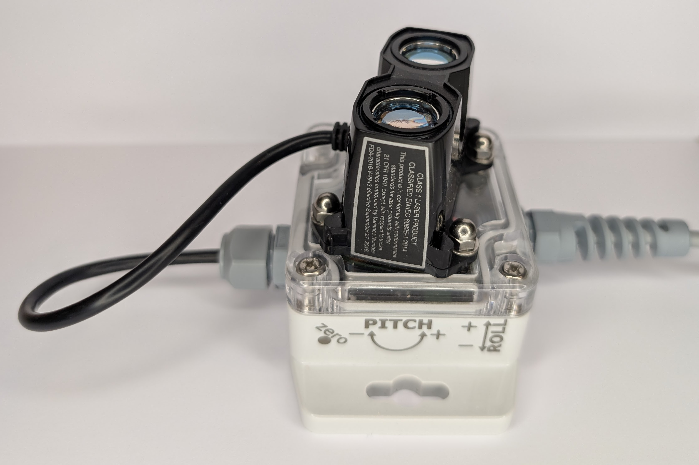
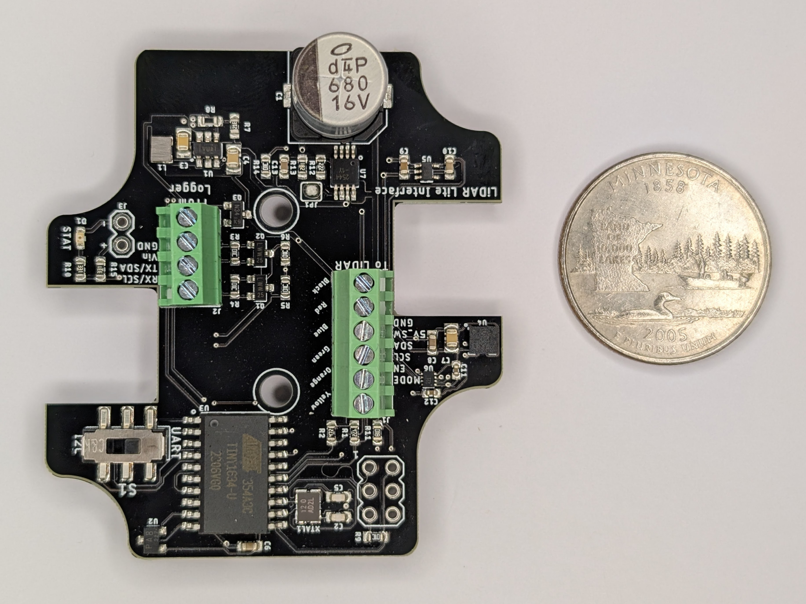

[](https://doi.org/10.5281/zenodo.3766447)

# Project-Apis
Design files for a support and interface unit for the Garmin LiDAR Lite.

## Contents

- [Namesake](#namesake)
- [Technical specifications](#technical-specifications)
  - [Electronic hardware](#electronic-hardware)
  - [Electronic software and firmware](#electronic-software-and-firmware)
- [Assembly](#assembly)
  - [Producing circuit boards](#producing-circuit-boards)
  - [Populating circuit boards](#populating-circuit-boards)
  - [Reflowing circuit boards](#reflowing-circuit-boards)
  - [Debugging circuit boards](#debugging-circuit-boards)
- [Firmware](#firmware)
  - [Downloading and installing the Arduino IDE](#downloading-and-installing-the-arduino-ide)
  - [AVR ISP](#avr-isp)
  - [Uploading the firmware](#uploading-the-firmware)
- [Writing a program to connect to the Apis](#writing-a-program-to-connect-to-the-apis)
  - [Very simple Arduino code](#very-simple-arduino-code)
  - [Northern Widget Margay code](#northern-widget-margay-code)
  - [Northern Widget Resnik code](#northern-widget-resnik-code)
- [Register map and firmware internals](#register-map-and-firmware-internals)
- [Housing and cabling](#housing-and-cabling)
  - [Parts required](#parts-required)
  - [Assembly](#assembly-1)
- [Field installation](#field-installation)
  - [Mast construction](#mast-construction)
- [Acknowledgments](#acknowledgments)

## Namesake

### Current: Apis


With its internal guidance system and compound eyes, the honeybee can obtain orientation and range while seeing in slow motion. Those rapid eyes feel perfect for a laser, and though the bee doesn't have one – it senses distance through parallax instead – just imagine if it did.

### Former: Symbiont-LiDAR


***The symbiont.*** *Lichens, like this Reindeer Lichen found in northeastern
Minnesota, are a symbiosis between fungi and algae. Our symbiosis is between
silicon, copper, aluminum, and laser. But be it nature or machine, some
partnerships are truly mutual in their benefits. Photo by Homer Edward Price.*

The [LiDAR Lite](https://buy.garmin.com/en-US/US/p/578152/pn/010-01722-10) is a rangefinder from Garmin capable of returning distances to objects up to 40 m away. It is an effective sensor for water, snow, and ice levels, among other purposes. Extensive work to characterize the LiDAR Lite for environmental sensing of water levels has been performed by:

Paul, J. D., Buytaert, W., & Sah, N.(2020). A technical evaluation of lidar-based measurement of riverwater levels. *Water Resources Research*, *56*, e2019WR026810. https://doi.org/10.1029/2019WR026810

## Technical specifications



***Assembled Apis unit.*** *The front face shows pitch and roll orientation conventions and the "zero" location (oval cutout, lower center) where the magnet is tapped to calibrate the accelerometer.*

### Electronic Hardware

* Microcontroller (computer) core
  * ATTiny1634
  * [Firmware](Firmware) written in Arduino-compatible C++
  * 12 MHz
* Sensors
  * Externally connected: [Garmin LiDAR Lite v3 HP](https://buy.garmin.com/en-US/US/p/578152/pn/010-01722-10)
  * On board
    * MEMS accelerometer to detect board angle
    * Hall-effect sensor to for user to trigger with a magnet after providing a known angle to the accelerometer. This corrects for offset errors in the accelerometer, significantly improving its angular accuracy.
* Connections and communications protocols
  * [LiDAR Lite v3 HP](https://buy.garmin.com/en-US/US/p/578152/pn/010-01722-10)
    * 6-pin screw-terminal header
    * Switchable 5V power supply
    * I2C
  * Data logger
    * Power in and Ground
    * Digital communications
      * I2C
* Power
  * Voltage limits: 3.3 ~ 5.5V
  * Power consumption: ~0.5mA @ 4.5V, take reading every 60 seconds, then power down
  * Power conditioning: Provides an onboard, high power, step up to 5V to allow for interface to 3.3V loggers
* Fault recovery: Using intermediate system to emulate an I2C connection prevents a global lockup of the logger system
* Status LED
* Open-source licensing via CC BY-SA 4.0




***Apis v0.1 board, top side.*** *Minnesota quarter (24.3 mm diameter) for scale.*

### Electronic Software and Firmware

* Programmable using the Arduino IDE https://www.arduino.cc/en/main/software
* [Firmware](Firmware/Apis_LiDAR_Firmware) available in this repository.
* [Software](https://github.com/NorthernWidget/Apis_Library) to use the Apis with Arduino-compatible devices
* Open-source licensing via GNU GPL 3.0

## Assembly


Assembling this sensor is possible by hand with sufficient skill and the following tools:
* Temperature-controlled soldering iron
* Hot-air rework station
* Equipment for stenciling with solder paste
* ESD-safe tweezers and workstation
* Solder wick

Most of the components on this board are coarse enough in pitch that assembly by hand is expected to be relatively straightforward. However, if you are concerned about this, there are PCB assembly workshops located in many parts of the world.

### Producing circuit boards

We recommend having circuit boards produced by a reputable manufacturer. Many are located in China, India, and other countries worldwide. You will need to provide the Gerber files, available in this repository alongside the board design files.

### Populating circuit boards

Before placing components, you will need solder paste and a stencil. A stencil allows you to apply a controlled, even amount of paste to all pads at once. If you have access to a laser cutter, you can [create your own stencil](https://learn.adafruit.com/smt-manufacturing/laser-cut-stencils); otherwise, most PCB manufacturers offer stencil production as an add-on service. In a pinch, a solder-paste syringe works but increases the risk of bridged connections. Additional guidance on stenciling is available [here](https://www.sparkfun.com/tutorials/58).

Once paste is applied, use tweezers — or a pick-and-place machine if available — to place each component onto its pads in the correct orientation. Slight misalignment is acceptable; surface tension from the molten solder will help pull components into place during reflow.

### Reflowing circuit boards

Reflowing heats the solder paste until it flows and bonds components to the board. A basic introduction is available [here](https://learn.sparkfun.com/tutorials/electronics-assembly/reflow). Common methods include:

1. **Professional reflow oven** — the most consistent method
2. **Converted toaster oven** — affordable and effective; see [SparkFun's guide](https://www.sparkfun.com/tutorials/60) and many other online references
3. **Electric skillet** — surprisingly effective for simple boards; [guide here](https://www.sparkfun.com/tutorials/59)
4. **Hot-air rework station** — more labor-intensive but gives fine control; suitable for single boards or small runs; [guide here](https://learn.sparkfun.com/tutorials/how-to-use-a-hot-air-rework-station/all)

After reflow, clean up any bridged connections with **solder wick**.

### Debugging circuit boards

Inspect the board carefully after reflow. Look for bridged connections, cold joints, or components that shifted out of alignment. A multimeter is essential for checking continuity and identifying shorts. An oscilloscope or logic analyzer can help verify that the microcontroller, accelerometer, and I2C bus are functioning correctly. If you are new to debugging circuit boards, working with an electrical engineering student or professional — even for a single session — can save significant time.

## Firmware

### Downloading and installing the Arduino IDE

Go to https://www.arduino.cc/en/main/software. Choose the proper IDE version for your computer. For Windows, we suggest the non-app version to have more control over Arduino; this might change in the future. You will have to add custom libraries, so the web version will not work (at least, as of the time of writing). Download and install the Arduino IDE. Open it to begin the next steps.

### AVR ISP

To install firmware on the Apis board, you use the [2x3-pin 6-pin ICSP (also called ISP) header](https://www.digikey.com/product-detail/en/3m/929665-09-03-I/3M156313-06-ND/681796) with a special device called an "in-circuit system programmer" (or just "in-system programmer; yup, that's what the acronym stands for).

Many devices exist to upload firmware, including:
* The official [AVR ISP mkII](http://ww1.microchip.com/downloads/en/DeviceDoc/Atmel-42093-AVR-ISP-mkII_UserGuide.pdf) (no longer produced but available used)
* Using an [Arduino as an ISP](https://www.arduino.cc/en/tutorial/arduinoISP)
* The versatile [Olimex AVR-ISP-MK2](https://www.olimex.com/Products/AVR/Programmers/AVR-ISP-MK2/open-source-hardware)
* The [Adafruit USBtinyISP](https://www.adafruit.com/product/46)

### Uploading the firmware

Using this ISP, upload [the firmware sketch](Firmware/Apis_LiDAR_Firmware) to the board. To do so, follow these steps:

1. Open the Arduino IDE.
2. Follow [these instructions](https://github.com/SpenceKonde/ATTinyCore/blob/master/Installation.md) to install the [ATTinyCore board definitions](https://github.com/SpenceKonde/ATTinyCore)
3. Select [ATTiny1634](https://github.com/SpenceKonde/ATTinyCore/blob/master/avr/extras/ATtiny_1634.md) **(No bootloader)**
4. Plug your ISP of choice into your computer (via a USB cable) and onto the 6-pin header. There are two ways to place it on; the header is aligned such that the ribbon cable should be facing away from the board while programming. If this fails without being able to upload, try flipping the header around. This should both power the board and provide communications.
5. Go to Tools --> Programmer and select the appropriate programmer based on what you are using.
6. Go to Tools --> Burn Bootloader. Yes, we know that you just selected "ATTiny1634 (No bootloader)", but this step sets the fuses, which configure their internal oscillator and brown-out detection.
7. Go to Sketch --> Upload Using Programmer. After several seconds, you learn whether you succeeded or failed. Hopefully it worked!


***Uploading using the in-system programmer.***

***Important note for Linux users:*** You must supply permissions to the Arduino IDE for it to be able to use the ICSP, or you will have to run it using `sudo`. The former option is better; the latter is easier in the moment.

***Note: Be sure to download and/or update drivers for your ISP.***


## Writing a program to connect to the Apis

Once it is bootloaded and connected with a LiDAR Lite sensor, you should be able to use any standard Arduino device to connect to it and read its data.

### Very simple Arduino code

This code is intended for any generic Arduino system.

```c++
#include "Apis.h"

// Declare variables -- just as strings
String header;
String data;

// Instantiate class
Apis myLaser;

void setup(){
    // Begin Serial connection to computer at 38400 baud
    Serial.begin(38400);
    // Obtain the header just once
    header = myLaser.getHeader();
    // Print the header to the serial monitor
    Serial.println(header);
}

void loop(){
    // Take one reading every (10 + time to take reading) seconds
    // and print it to the screen
    myLaser.updateMeasurements();
    data = myLaser.getString();
    Serial.println(data);
    delay(10000); // Wait 10 seconds before the next reading, inefficiently
}
```

### Northern Widget Margay code

The [Margay data logger](github.com/NorthernWidget-Skunkworks/Project-Margay) is the lightweight and low-power open-source data-logging option from Northern Widget. It saves data to a local SD card and includes on-board status measurements and a low-drift real-time clock. We have written [a library to interface with the Margay](github.com/NorthernWidget-Skunkworks/Margay_Library), which can in turn be used to link the Margay with sensors.

```c++
#include "Margay.h"
#include "Apis.h"

// Declare variables -- just as strings
// Empty header to start; will include sensor labels and information
String header = "";
String data;

// Instantiate classes
Apis myLaser;
Margay Logger; // Margay v2.2

// I2CVals for Apis
uint8_t I2CVals[] = {0x50}; // DEFAULT

//Number of seconds between readings
uint32_t updateRate = 60;

void setup(){
    header = header + myLaser.getHeader();
    Logger.begin(I2CVals, sizeof(I2CVals), header);
    initialize();
}

void loop(){
    Logger.run(update, updateRate);
}

String update() {
    initialize();
    return myLaser.getString();
}

void initialize(){
    myLaser.begin();
}
```

### Northern Widget Resnik code

>> The Resnik/Okapi system uses a Particle Boron for cellular telemetry — the defining capability that distinguishes it from the Margay. That telemetry component is not yet shown here; the code below is currently identical to the Margay example. See [issue #21](https://github.com/NorthernWidget/Project-Apis/issues/21).

```c++
#include "Resnik.h"
#include "Apis.h"

// Declare variables -- just as strings
// Empty header to start; will include sensor labels and information
String header;
String data;

// Instantiate classes
Apis myLaser;
Resnik Logger;


// I2CVals for Apis
uint8_t I2CVals[] = {0x50}; // DEFAULT

//Number of seconds between readings
uint32_t updateRate = 60;

void setup(){
    header = header + myLaser.getHeader();
    Logger.begin(I2CVals, sizeof(I2CVals), header);
    initialize();
}

void loop(){
    Logger.run(update, updateRate);
}

String update() {
    initialize();
    return myLaser.getString();
}

void initialize(){
    myLaser.begin();
}
```

## Register map and firmware internals

The Apis firmware runs on an ATTiny1634 and exposes an I2C register map to the host logger. The default I2C address is `0x50`.

The device exposes a flat, byte-addressable virtual address space. The master writes a 1-byte starting address, then reads up to 32 bytes in one transaction. Pages are 32-byte aligned.

Two layouts exist: the **current firmware** (Schema 1 prototype, deployed) and the **proposed** layout under [NW-Device-Specification](https://github.com/NorthernWidget/NW-Device-Specification) Schema 1, which the firmware will be updated to implement. The proposed layout is not yet in the firmware.

### Measurement loop

On each measurement cycle, the firmware:
1. Powers on the LiDAR Lite via its switchable 5 V supply
2. Triggers a range measurement over software I2C
3. Reads the 16-bit range value and signal strength from the LiDAR Lite
4. Reads the 3-axis accelerometer (LIS3DH)
5. Updates all output registers
6. Powers down the LiDAR Lite

### Current register map (deployed firmware — Schema 1 prototype)

A single 32-byte page. Status and identity are mixed; no schema byte.

| Address | Name | R/W | Description |
|---------|------|-----|-------------|
| `0x00` | `REG_STATUS` | R | Measurement ready: `1` = ready, `0` = busy |
| `0x01` | `REG_NAME_0` | R | Device name byte 0: `'A'` |
| `0x02` | `REG_NAME_1` | R | Device name byte 1: `'p'` |
| `0x03` | `REG_NAME_2` | R | Device name byte 2: `'i'` |
| `0x04` | `REG_NAME_3` | R | Device name byte 3: `'s'` |
| `0x05` | `REG_HW_MAJOR` | R | Hardware major version |
| `0x06` | `REG_HW_MINOR` | R | Hardware minor version |
| `0x07` | `REG_FW_PATCH` | R | Firmware patch version |
| `0x08`–`0x09` | `REG_RANGE` | R | Range, little-endian int16 [cm] |
| `0x0A` | `REG_SIGNAL_STR` | R | LiDAR Lite signal strength (0–255) |
| `0x0B` | `REG_CONFIG` | R/W | Sensitivity mode [bits 1:0] (see below) |
| `0x0C` | `REG_I2C_ADDR` | W | Write to change I2C address (persists to EEPROM) |
| `0x0D`–`0x0F` | — | — | Reserved |
| `0x10`–`0x15` | `REG_ACCEL` | R | Accel X/Y/Z, three little-endian int16 values |
| `0x16`–`0x17` | — | — | Reserved |
| `0x18`–`0x1D` | `REG_OFFSET` | R | Accel offsets X/Y/Z, three little-endian int16 values |
| `0x1E`–`0x1F` | — | — | Reserved |

### Proposed register map (NW-Device-Specification Schema 1)

Three 32-byte pages. Identity is EEPROM-backed; sensor data is SRAM-backed; calibration is served directly from EEPROM.

**Page 0 (0x00–0x1F) — Identity (EEPROM)**

```
Block 0 (0x00–0x07)   Core identity
  0x00        0x01              Schema (NW-Device-Specification v1)
  0x01–0x04   'A','p','i','s'   Device name (ASCII)
  0x05–0x07   0x00,0x00,0x00    Null padding

Block 1 (0x08–0x0F)   Version
  0x08        HW major
  0x09        HW minor
  0x0A        FW patch          (NW combined-repo convention)
  0x0B–0x0D   0x00,0x00,0x00    Unused (combined repo)
  0x0E–0x0F   0x00,0x00         Reserved

Block 2 (0x10–0x17)   Serial number
  0x10–0x11   0x41,0x01         Board type ('A' = 0x41, revision index 1)
  0x12–0x13   [manufacture]     Group ID
  0x14–0x15   [manufacture]     Unique ID
  0x16–0x17   0x00,0x00         FirmwareID (legacy, reserved)

Block 3 (0x18–0x1F)   Integrity + administration
  0x18–0x1C   0x00 ×5           Reserved
  0x1D        0x00              Magic byte (reserved; purpose TBD)
  0x1E        [computed]        CRC-8 of bytes 0x00–0x1D
  0x1F        0x50              I2C address (writable; 0xFF = use default)
```

**Page 1 (0x20–0x3F) — Sensor data (SRAM)**

```
Block 0 (0x20–0x27)   LiDAR
  0x20        Status            bit 0=ready, bit 1=LiDAR fault, bit 2=accel fault,
                                bit 7=pan-fault
  0x21–0x22   Range [cm]        little-endian int16
  0x23        Signal strength   uint8
  0x24        Config            sensitivity [bits 1:0], writable
  0x25–0x26   Reserved
  0x27        Extended faults (reserved, 0x00)

Block 1 (0x28–0x2F)   Accelerometer
  0x28–0x29   Accel X           little-endian int16
  0x2A–0x2B   Accel Y           little-endian int16
  0x2C–0x2D   Accel Z           little-endian int16
  0x2E–0x2F   Reserved

Block 2–3 (0x30–0x3F)   Reserved
```

Check bit 0 of 0x20 before using any measurement. If clear, all other Page 1 bytes are stale.

**Page 2 (0x40–0x5F) — Calibration (EEPROM, served directly)**

```
Block 0 (0x40–0x47)   Accelerometer offsets
  0x40–0x41   Offset X          little-endian int16
  0x42–0x43   Offset Y          little-endian int16
  0x44–0x45   Offset Z          little-endian int16
  0x46–0x47   Reserved

Block 1–3 (0x48–0x5F)   Reserved
```

### Sensitivity modes

Write one of the following values to the config register to set the LiDAR Lite measurement sensitivity:

| Value | Description |
|-------|-------------|
| `0` | Balanced range and noise (default) |
| `1` | Higher sensitivity; reduced maximum range |
| `2` | Lower sensitivity; extended maximum range |
| `3` | Maximum range mode |

### Persistent I2C address

The I2C address register is writable and persisted to EEPROM. It takes effect on the next power cycle. This allows multiple Apis boards to share a single I2C bus — assign each a unique address (e.g., `0x50`, `0x51`).

### Firmware compatibility and detection

The Apis_Library reads the name bytes during `begin()` and returns `false` if they do not spell `Apis`. Check the return value of `begin()` when deploying to new or previously programmed hardware.

## Housing and cabling

### Parts required

This is what we used for our build; you can be creative based on materials and availability.

* Main enclosure
  * Polycase box [WC-20F (clear lid)](https://www.polycase.com/wc-20f)
  * [2x \#4 screws](https://www.polycase.com/screws-mbr-100) to mount Apis board in box
  * Cable gland ([Heyco M4365](https://www.heyco.com/Liquid_Tight_Cordgrips/product.cfm?product=Liquid-Tight-Cordgrips-Metric&section=Liquid_Tight_Cordgrips)) for cable to LiDAR Lite
  * Strain-relieved cable gland ([Heyco M4425](https://www.heyco.com/Liquid_Tight_Cordgrips/product.cfm?product=Liquid-Tight-Cordgrips-Pigtail-Metric&section=Liquid_Tight_Cordgrips)) for cable to logger
  * Desiccant packs
* LiDAR Rangefinder and attachment to enclosure
  * [LiDAR Lite sensor](https://www.sparkfun.com/products/14599)
  * [4 sealing screws](https://www.mcmaster.com/90825A144/): \#4-40 x 3/8"
  * [4 washers](https://www.mcmaster.com/90107A005) for \#4 screws
  * [4 cap nuts](https://www.mcmaster.com/99022A101) for \#4-40 screws
* Mounting plate
  * Material: Acetal (Delrin) sheet: 1/4" thick. We commmonly use [12x24" black](https://www.eplastics.com/ACTLBLK0-25012X24); the black pigment increases its UV resistance
  * Rectangular dimensions for mount: 127 x 95.25 x 6.35 mm (5.00" x 3.75" x 0.25")
  * [Design](https://easel.inventables.com/projects/VMmCoOyJyiiKTospk1NBBQ) on Easel for X-carve (see also [CNC files here](CNC)). Note the 7 mm depth to ensure that the bit cuts all the way through the Acetal; use a piece of scrap material on your cutting bed if you want to protect it.
* Mounting plate fasteners
  * 1/4"-20 hardware to attach the box to the mounting plate
    * Bolts: [1" long; hex head convenient; zinc-plated medium-grade (Grade 5) recommended for lower price with good corrosion resistance](https://www.mcmaster.com/92865A542)
    * Nuts: [Zinc-plated Grade 5](https://www.mcmaster.com/95462A029)
    * Washers: Zinc-plated [SAE](https://www.mcmaster.com/90126A029) or [USS](https://www.mcmaster.com/90108A413)
    * Lock washers: We typically use [split-lock washers](https://www.mcmaster.com/zinc-plated-steel-washers/), but [tooth-lock washers](https://www.mcmaster.com/91113A029) are good for high-vibration environments.
  * 2 U bolts: 1/4"-20, inner diameter 3/4" to 1 3/4", to attach the mounting plate to a pipe. We typically mount this sensor on 3/4" pipe or conduit, and recommend a U bolt designed to fit this ([1/4"-20, 1 1/8" inner diameter](https://www.mcmaster.com/u-bolts/u-bolts-with-mounting-plates/for-pipe-size~3-4/)). Weather/corrosion resistance is helpful, especially if you are concerned about later removing the U bolts.
* Cable to logger
  * 3 m (or less) [4-conductor AlphaWire](https://www.digikey.com/product-detail/en/alpha-wire/5004C-SL001/5004CSL001-ND/484976), stripped and tinned at both ends. Other cables will work too; this is what we have found to be highest quality and reliability. We cannot guarantee successful I<sup>2</sup>C communications over cables longer than 3 meters.


***Mounting plate perspective view in [Easel](https://easel.inventables.com/projects/VMmCoOyJyiiKTospk1NBBQ)*** *for easy integration with the X-carve series of lower cost CNC routers.*

### Assembly

Prior to assembly, ensure that you have:
* [Uploaded the firmware to the Apis board](#Uploading-the-firmware)
* Fabricated [the mounting plate](CNC) (see also the [Easel online CNC setup](https://easel.inventables.com/projects/VMmCoOyJyiiKTospk1NBBQ)) if desired.

1. Drill and tap 12 mm holes in the side of the box. Use a M12-1.5 tap for the threads.

2. Install the Apis board as shown below using two of the \#4 self-tapping screws.


3. Using the sealing screws, cap nuts, and washers, install the LiDAR Lite sensor onto the lid. By mounting the LiDAR Lite at an angle, you can fix it to the box lid in a way that still allows the box to open and close properly. The cap nuts go on the outside of the housing.


4. Thread the cables through the cable glands and attach them to the screw terminals. A 1.8 mm flat-head screwdriver can be very useful for this. Note that these cables cross the board in the above image (upper left) -- and that (unlike in the image!) you should do this *after* the board is in the box.

5. Using the switch in the box, select the desired communications protocol. For most of our uses, this is I2C.

6. Attach the cable to the data logger.

7. Test the LiDAR Lite unit.

8. When satisfied with the tests, turn off the data logger and place a protective cover over the lenses of the LiDAR Lite for safety during transport. We have [a set of "safety glasses" available for 3D printing](3Dprint). You may want to secure these in place with electrical tape.

9. Place desiccant in the box. I typically install two small desiccant packs on the side of the board above the switch and large capacitor and pack them in so they are unlikely to move; this is in order to keep the indicator LED visible.

10. Securely screw the lid onto the box to seal the LiDAR Lite + Apis unit.

11. Mark the corner of the box next to the Hall-effect sensor, and mark the orientations of the roll and pitch axes. The pitch axis should be positive when the long strain-relieved cable gland tilts upwards. The roll axis should be positive when, when looking at the side of the assembly such that the long strain-relieved cable gland is on the left and the laser rangefinder is pointed up, the laser rangefinder rolls towards you.


***Pitch, roll, and Hall-effect calibration location on the assembled unit.*** *The "zero" oval cutout on the lower center of the box face marks where to tap the magnet.*

12. Place the box on a measured flat surface and tap the magnet to the marked location by the Hall Effect sensor. This will appropriately zero the offsets for the sensor and increase its near-horizontal accuracy significantly. This must be done when the sensor is powered; the LED will light up during the full duration of magnetic contact. When connected to a logger, this can be done by putting the magnet in place, hitting the "RESET" button (e.g., on a Margay logger), and then holding the magnet in place with the read light on until the first reading is complete. Doing this while connected to a computer is recommended in order to see the first reading on the serial monitor and double check that the zeroing/calibration is appropriate. For a convenient magnet holder, you can use our [3D-printable magnetic wand][3Dprint], which holds a small rare-Earth magnet. This may be a generic part, though this [3/8" x 1/8" Neodymium Disk Magnet](https://www.apexmagnets.com/magnets/3-8-x-1-8-disc-neodymium-magnet) works well in our experience.

13. Use the 1/4"-20 hardware to attach the LiDAR Lite box to the mounting plate. The bolts pass through the center holes on the tabs on either side of the box, with their heads towards the box lids.

>> Note: Mounting plate holes currently too small for these; will need to be updated. Currently using #8 hardware. Figures for pitch+roll have 1/4-20 -- I probably drilled it out wider for these.

14. (Can wait for field installation) attach the unit via its mounting plate to the appropriate pipe, post, etc. This typically involves the U bolts, noted above. Curved EMT conduit can be helpful for providing a way to select the angle of the sensor. Although we use a single 45-degree bend piece of conduit in the images below, we might suggest attaching a 90-degree bend conduit first, and then a 45-degree bend as necessary to adjust the sensor away from a direct down-looking view; the sensor will attach directly to the convex side of the bend instead of bridging over airspace, which required us to use rocks as shims to reduce mounting-plate flexure. (This suggestion, however, increases torque on the mast; future field testing is needed to determine the best method.) ***Note: The LiDAR Lite unit will likely give a return only if its angle to the surface that it is measuring is steeper (i.e., more orthogonal) than 45 degrees.***


## Field installation


***Lab mock-up of field installation for LiDAR Lite.*** *The boxes at right contain [Northern Widget Margay](https://github.com/NorthernWidget-Skunkworks/Project-Margay) data loggers with a single cable gland to connect to the Apis box. The two posts next to them provide examples of how to connect the 3/4" EMT conduit to some fixed point in the environment, either the side of a flat(ish) wall (right) -- though the brackets aren't necessary or even always good, since we can bolt right through the pipe -- or to a flat(ish) surface using a floor flange. We drilled holes through the conduit to attach 1/4" eye bolts (1/4"-20, 1.5" long) using nuts, lock washers, and washers, to the conduit. These eye bolts then held turnbuckles to which we attached cables (lower left). The other end of the cables can be attached via sleeve or wedge anchors to rock, or to other sturdy structures. The LiDAR Lite + Apis is in the upper left corner, albeit attached in a way that would have it looking up... unless it were attached to the end of the 90-degree bend.*

### Mast construction

#### Supplies

* 3/4" EMT rigid conduit
  * Straight: main mast
  * 90-degree bend
  * 45-degree bend
* 3/4" Conduit screw-down connectors (to join multiple pieces of conduit)
* 3/4" Conduit-to-threaded connectors (to link smooth conduit to threaded 3/4" plumbing, needed only if you use a floor flange)
* Floor flange (1, if you want to attach to a flat surface)
* 1/4-20 x 1.5" eye bolts (3, +1 in case you bend/break one)
* 1/4" x 2+" long sleeve or wedge anchors; 4 for the floor flange or 2 for bolting into the side of a rock. Extras suggested, as these can be broken during installation.
* Turnbuckles; I suggest getting 3 that are threaded all the way down (as shown in the picture above). Get an extra in case you break one.
* 1/8" metal cable
* 1/8" cable clamps (x6, +1 in case you lose the nuts)
* 1/8" metal cable turns (x6; if you lose one, don't worry; these are nice for durability but not totally necessary)
* 3/8" x 2.5+" long sleeve or wedge anchors for the cables; these are less breakable than their 1/4" cousins, but you might still want an extra one.
* Extra 1/4"-20 hardware. I almost always end up needing this.
* Cable management (keep secure and prevent from flapping in the wind, which can cause damage)
  * Cable ties (zip ties). Ensure that these are UV-resistant; many black ones are.
  * Electrical tape
* *Optional:* 2x ~1-3/4" hose clamps if mounting a data-logger box for the [Margay](https://github.com/NorthernWidget-Skunkworks/Project-Margay) on the main mast. Longer hose clamps (or multiple 1-3/4" clamps in series) for larger logger boxes, so long as they can remain stable on the mast.

You might not need the guy wires and associated hardware if you bolt your assembly to the side of something (like a rock or wall). Some guy wires are generally encouraged.

#### Assembly


***Placing and leveling the base.***


***Installing the base using wedge anchors.***


***Installing the conduit and anchoring it with eye bolts and turnbuckles.*** *Before going out to the field, we strongly suggest you pre-drill the holes and pre-install the eye bolts.*


***Tightening the cable around the bolt in the rock using the cable clamp.***


***Aiming the LiDAR Lite unit at the river.*** *In future models, we are considering adding peep sights to the mounting bracket. [Professor Billy Armstrong](https://earth.appstate.edu/faculty-staff/dr-william-h-armstrong) in the photo.*

The quality of any zeroing with the Hall-effect sensor will be limited by the ~1-degree precision of the accelerometer that is used as an inclinometer; as an additional check, it is recommended to measure and record the orientation of the field-mounted unit by hand.


***Fully installed clifftop unit***


***Fully installed clifftop unit*** *Note data-logger box attached with cable ties, as well as the mounting-plate attachment. For the latter, we used a rock as a shim with a 45-degree piece of EMS conduit. However, it may have been better to use a 90-degree piece of conduit and a 45-degree piece of conduit together to keep us from needing this shim -- though this would have increased torque on the main mast.*


***Alternative method: installing on the side of a rock.***


***Full mast installed on the side of a rock.*** *Note the LiDAR Lite + Apis and the data-logger box.

## NW-Device-Specification — Schema 1, Page 0

Implements [NW-Device-Specification](https://github.com/NorthernWidget/NW-Device-Specification) Schema 1. The 32-byte identity block (Page 0) is stored at the top of EEPROM:

```
Block 0:  Schema=0x01, Name='A','p','i','s',0x00,0x00,0x00
Block 1:  HW major=[mfr], HW minor=[mfr], FW patch=[mfr], 0x00,0x00,0x00, Reserved
Block 2:  Board type=0x4100 ('A'=0x41, rev 0), Group ID=[mfr], Unique ID=[mfr], FirmwareID=0x0000
Block 3:  Reserved, Magic=0x00, CRC=[computed], I2C address=0x41
```

Legacy deployed units carry board type `0x6C00` and I²C address `0x50` (pre-Schema-1).

## Acknowledgments

Support for this project provided by:


<br/>
<br/>
<a rel="license" href="http://creativecommons.org/licenses/by-sa/4.0/"></a><br />This work is licensed under a <a rel="license" href="http://creativecommons.org/licenses/by-sa/4.0/">Creative Commons Attribution-ShareAlike 4.0 International License</a>.
